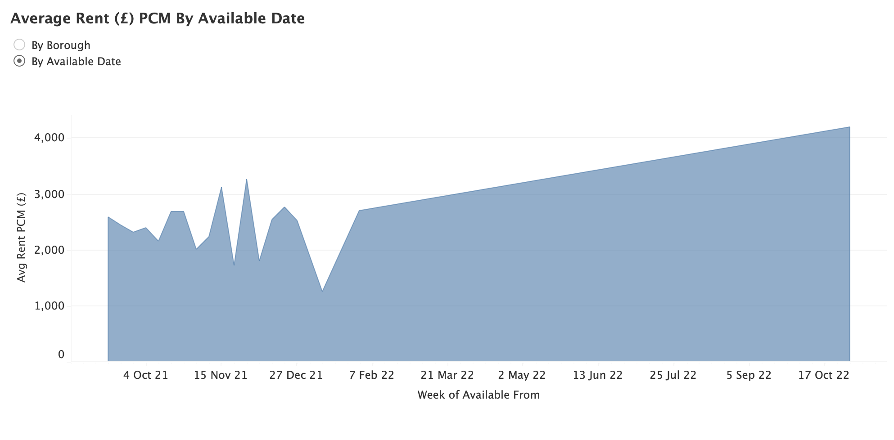

# London Flat Analysis

- Built a custom web crawler to automatically download listing information from a popular UK letting website and save it to a local SQLite database.
- Created a data-cleaning pipeline through which I pass freshly scraped data that uniformly parses data into new features that aide in analysis.
- Used Tableau Desktop to design and build a custom dashboard for identifying ideal rentals.
- Performed data cleaning, exploratory data analysis as well as feature engineering on collected data.
- Trained & Optimised a Random Forest Regression model with an RMSE of roughly 123 which I am currently utilising to identify both "fairly" priced listings as well as those that may be potentially undervalued.

*The workbook containing the Machine Learning / Data Science workflow is in this repository named "Flat Rental Analysis & Modelling.ipynb" and contains further commentary.*

## Framing The Problem

- Objective: Gather and utilise existing data to visualise real estate trends over time in London. I am hoping to identify potentially undervalued flats / areas within the city for further analysis.

### Data Collection

I created a custom web crawler to collect this data automatically. I chose to scrape the data from Openrent as it had all of the data points I was interested in. 

The data points I chose to pull off of Openrent were:
[listing title, listing summary, number of beds, number of bathrooms, max occupancy, cost of deposit, rent cost, bills included (Y/N), family friendly (Y/N), pet friendly (Y/N), smoker friendly (Y/N), available from date, minimum tenancy length, garden (Y/N), parking (Y/N), fireplace (Y/N), furnished (Y/N), closest transport station, distance to nearest transport station, property ID, link to the property]

Major challenge(s) overcame:
- Openrent's homepage implements a "lazy-loading" which means that listings only load as the user slowly scrolls down the page. Therefore I decided to use Selenium to automate the process of scrolling down the web page to load all the listings initially. From there I requested the entire web page HTML which I parsed with Beautiful Soup.

## Data Cleaning & Engineering

After scraping the data I needed to clean it up in various ways. The modifications I made to the data were:

- Modified the *available from* date to replace "today" with the date the listing was scraped.
- Parsed the *distance to station* feature and created a new *walk time to station* feature.
- Parsed the *minimum tenancy* feature to take out only the number of months; removing all excess information in this column.
- Removed excess characters from the price fields and changed the data types.
- Grouped the listings into *listing_type* based on the text contained in *title* (flat, studio, maisonette, shared). 
- Used the *postcode* feature to determine if the part of London played a part in monthly rent (North vs. East)
- Calculated the bedroom/bathroom ratio for each listing.
- Utilised the *available_from* date to see if moving in certain seasons would be more cost effective.
- Created a new feature, *postcode* using the *title* feature.
- Created multiple calculations in Tableau to aide in dashboard creation including: 
	* "Still on the market" (T/F), 
	* "Days on the market", 
	* "Borough" (Mapped the postcode from above to a more human readable version)

## Data Visualisation

For this analysis I created a Tableau Desktop dashboard that would update each time I collected new data. Below are some screenshots of the current version of this dashboard that I use for flat analysis:

## Next Steps

- Set up automatic scraping on Raspberry Pi or similar
- Look into creating a similar scraper / pipeline for houses for sale all over the UK (personal investment)

## Code & Resources Used

- **Python Version:** 3.7
- **Python Libraries:** Selenium, Requests, Beautiful Soup, NumPy, pandas
- **Tableau Desktop Version:** 2021.2
- **Inspiration:** https://medium.com/geoai/house-hunting-the-data-scientist-way-b32d93f5a42f
